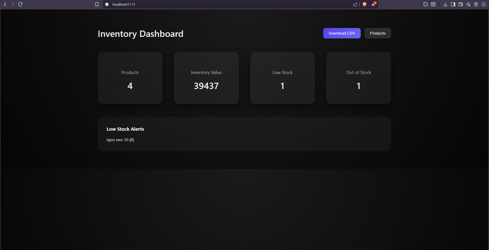
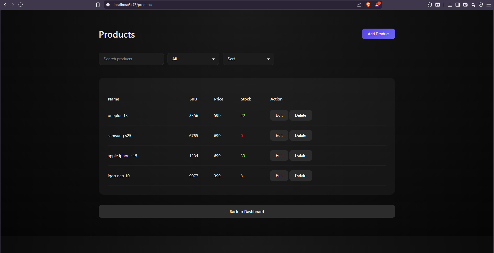

# Inventory Management System

A full-stack Inventory Management Dashboard built using React (Vite) and Node.js (Express).

This application helps merchants manage products, track stock levels, identify low or out-of-stock items, and view basic inventory analytics.

Built as part of an engineering assignment to demonstrate full-stack development, product thinking, and clean implementation.

---

## Live Demo

Frontend: https://im-system-shivanshs-projects-31a0a965.vercel.app
Backend: https://im-system-6hdu.onrender.com

## Note

Backend is hosted on Render free tier.  
First request may take ~30 seconds to wake up.

##  Features

### Product Management (CRUD)

- Add new products with:
  - Name
  - SKU
  - Price
  - Stock quantity
  - Minimum stock threshold
- Edit existing products
- Delete products (with confirmation)
- Color-coded stock status:
  - 🟢 In Stock
  - 🟡 Low Stock
  - 🔴 Out of Stock

### Dashboard Analytics

- Total products
- Total inventory value
- Low stock count
- Out of stock count
- Low stock alerts section

### Search, Filter, Sort

- Search by product name or SKU
- Filter by:
  - All
  - In Stock
  - Low Stock
  - Out of Stock
- Sort by:
  - Name
  - Price
  - Stock level

### Bonus

- CSV Export of inventory
- Clean modern UI dashboard

---

## Screenshots

### Dashboard



---

### Products Page



---

### Add / Edit Product


---

## 🛠 Tech Stack

### Frontend
- React (Vite)
- JavaScript
- Custom CSS

### Backend
- Node.js
- Express

### Data Storage
- In-memory array (no database)

---

## 📂 Project Structure

```
IM-system/
├── client/ # React frontend
└── server/ # Node + Express backend
```
---

## ⚙️ Setup Instructions

### 1. Clone Repository

```bash

git clone https://github.com/BON1TO/IM-system.git
cd IM-system

2. Backend Setup
cd server
npm install
node server.js
Backend runs on:
http://localhost:5000

3. Frontend Setup
Open new terminal:
cd client
npm install
npm run dev
Frontend runs on:
http://localhost:5173

📤 CSV Export :
You can download inventory CSV from:
http://localhost:5000/api/export/csv

